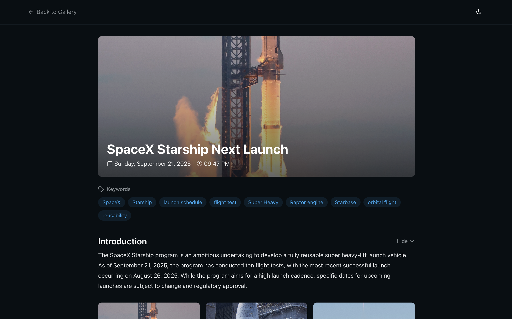
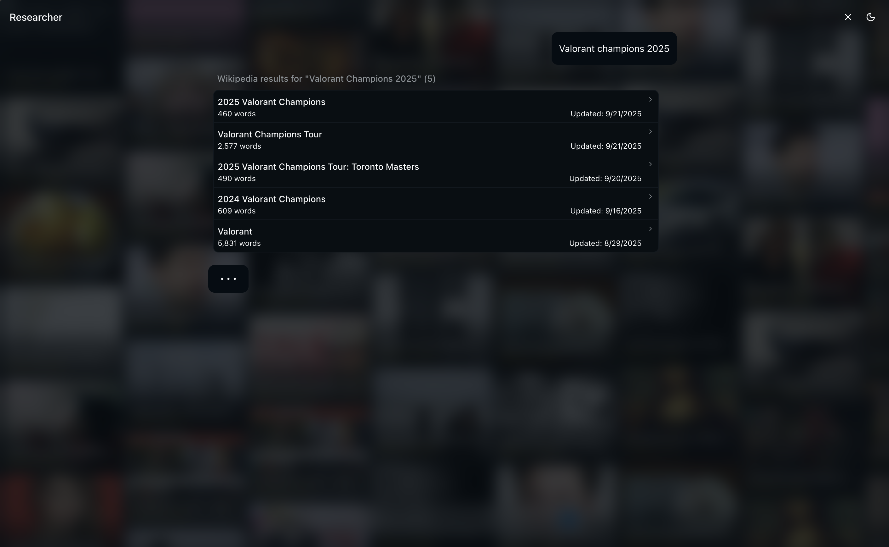
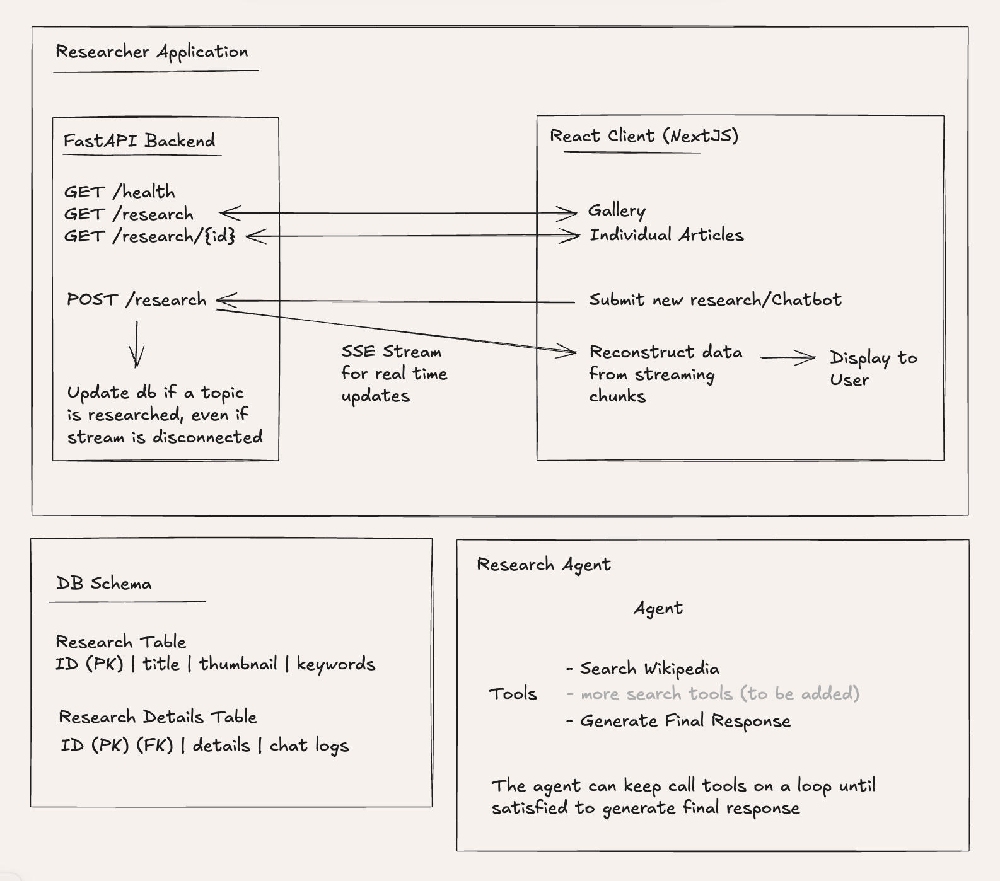

## Researcher AI

This app pairs a Next.js 15 client with a FastAPI backend that streams responses using Server‑Sent Events and persists results to SQLite. The agent can call local tools (Wikipedia search, final result aggregator) and writes structured output plus logs to the database.

## Next.js
- **Framework**: Next.js 15, React 19, Tailwind v4
- **.env**:
  - `NEXT_PUBLIC_API_URL` – base URL for the FastAPI service
  - `NEXT_PUBLIC_MODEL_NAME` – default model for streaming (default: `gemini/gemini-2.5-flash`)
- **routes**:
    - `/` – Infinite gallery populated from `GET /research` with column scrolling
    - `/chat` – Standalone chat window
    - `/gallery/[id]` – Page that renders research article

### Screenshots





## Backend (FastAPI)
- **entrypoint**: `backend/fastapi_server.py`
- **runtime**: `uvicorn` inside a slim `uv` Python 3.12 image
- **database**: SQLite (`backend/research.db`, persisted via Docker volume)
- **.env** (configure as needed for the model provider via LiteLLM):
  - `GROQ_API_KEY`, `GEMINI_API_KEY`, `GOOGLE_API_KEY`

### REST + Streaming API
- `GET /health` → `{ status: "healthy" }`
- `GET /research` → Latest 50 research rows
- `GET /research/{id}` → Research row + details + logs
- `POST /research` → Streams SSE tokens and tool activity; body:
```json
{
  "messages": [ { "role": "user", "content": "<query>" }, ... ],
  "model": "gemini/gemini-2.5-flash"
}
```

SSE lines are sent as `data: <json>\n\n` where the JSON is:
```json
{ "v": "token" }  // text chunk
{ "tc": ... }  // tool call
{ "tr": ... }  // tool result
```

### Architecture


### Database schema (SQLite)
Defined in `backend/database.py`:
```sql
CREATE TABLE IF NOT EXISTS research (
  researchID   INTEGER PRIMARY KEY AUTOINCREMENT,
  title        TEXT NOT NULL,
  thumbnail    TEXT,
  keywords     TEXT,           -- JSON array
  created_at   TEXT NOT NULL,
  updated_at   TEXT NOT NULL
);

CREATE TABLE IF NOT EXISTS research_details (
  researchID   INTEGER PRIMARY KEY,
  details      TEXT NOT NULL,  -- JSON object from final_result_tool
  logs         TEXT NOT NULL,  -- JSON array of OpenAI-style messages (no system)
  created_at   TEXT NOT NULL,
  FOREIGN KEY (researchID) REFERENCES research (researchID)
);
```

### Agent + Tools
Implemented in `backend/researcher.py`:
- **Local tools**: `wikipedia_search`, `final_result_tool`
- Agent loops with LiteLLM streaming; when `final_result_tool` is called, the service writes `details` and `logs` to DB, even if the client disconnects mid‑stream.

## Run Locally

### 1) Start the backend (Docker Compose)
```bash
cd backend
docker compose up --build -d
# Backend will listen on http://localhost:8000
# Health check:
curl -s http://localhost:8000/health | jq .
```

Notes:
- `research.db` is bind‑mounted so the DB persists across restarts.
- Pass API keys via your shell env before `docker compose up`, for example:
```bash
export GEMINI_API_KEY=... GROQ_API_KEY=... GOOGLE_API_KEY=...
```

### 2) Start the frontend (Next.js)
```bash
cd frontend
pnpm install
NEXT_PUBLIC_API_URL=http://localhost:8000 \
NEXT_PUBLIC_MODEL_NAME=gemini/gemini-2.5-flash \
pnpm dev

# app → http://localhost:3000
```

## Deploy

### Backend → Fly.io
`backend/fly.toml` is present. From the `backend/` directory:
```bash
fly auth login
fly launch --copy-config --now --no-deploy   # uses existing fly.toml, creates app
fly secrets set GEMINI_API_KEY=... GROQ_API_KEY=... GOOGLE_API_KEY=...
fly deploy
```
After deploy, note the public URL (e.g. `https://<app>.fly.dev`).

### NextJS → Vercel

Configure project environment variables:
- `NEXT_PUBLIC_API_URL` = `https://<app>.fly.dev`
- `NEXT_PUBLIC_MODEL_NAME` = `gemini/gemini-2.5-flash` (or override)

Connect the repo and deploy.

## Note
- SSE uses long‑lived responses; proxies/CDNs must allow streaming for the `/research` POST route
- CORS is `*` by default in the backend middleware


